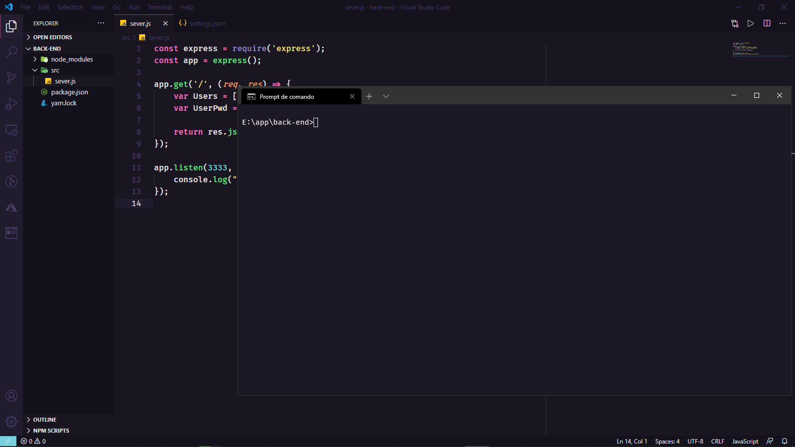

# Rocketseat Omni-Theme for Windows Terminal
## Eu descidi fazer o tema da Rocketseat para o Terminal do Windows!
Segue abaixo exemplo de como ficou o terminal:

Como instalar:
1- Com seu Windows Terminal aberto, pressione as teclas CRTL+,

2- Assim que o arquivo .json de configurações abrir procure pelo elemento: "schemes": {}

3- dentro de "schemes":{}, cole o texto a seguir:

### {
###        "name": "Omni",
###        "cursorColor": "#eee5f3",
###        "selectionBackground": "#44475A",
###        "background": "#1d1825",
###        "foreground": "#f8f2f8",
###        "black": "#21222C",
###        "blue": "#BD93F9",
###        "cyan": "#8BE9FD",
###        "green": "#50FA7B",
###        "purple": "#FF79C6",
###        "red": "#FF5555",
###        "white": "#fcf9ff",
###        "yellow": "#F1FA8C",
###        "brightBlack": "#6272A4",
###        "brightBlue": "#6a72e9",
###        "brightCyan": "#A4FFFF",
###        "brightGreen": "#69FF94",
###        "brightPurple": "#FF92DF",
###        "brightRed": "#FF6E6E",
###        "brightWhite": "#FFFFFF",
###        "brightYellow": "#f7f762"
### }

4- Procure pelo elemento "profiles": {}

5- Dentro de profiles crie outro elemento chamado "defaults": {} como mostra a seguir o código:

### "profiles": {
###    "defaults": {
###
###   },
### }

6- Dentro de Defaults, adicione o "colorScheme":{}, como mostra o código a seguir:

### "profiles": {
###    "defaults": {
###      "colorScheme": "Omni",
###   },
### }

## Pronto agora você ja tem o Tema da Rocketseat para o Windows Terminal!"# Omni-Theme" 
